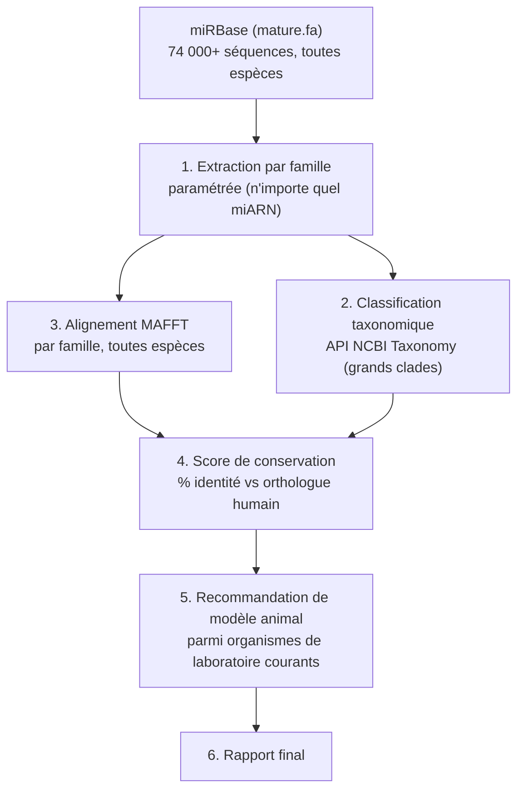

# mirna-conservation-analysis

[](https://www.docker.com/)
[](LICENSE)

**Conservation inter-espèces de microARN musculaires/cardiaques et choix de modèle animal**

> Auteur : Romain KPAKOU | Master 2 Bioinformatique, Nantes Université
> GitHub : [github.com/romainkpakou](https://github.com/romainkpakou)

---

## Contexte

Étude de la conservation d'un panel de microARN musculaires/cardiaques ("myomiRs") —
*miR-1*, *miR-133a*, *miR-208a*, *miR-208b*, *miR-499a* — et de *let-7a* comme référence
de conservation profonde, avec établissement d'un profil automatisé et recommandation de
modèle animal. Panel cohérent avec le fil cardiaque des projets précédents de cette série
(*MYH7* dans le panel [cnv-clinical-pipeline](https://github.com/romainkpakou/cnv-clinical-pipeline),
RNA-seq cardiaque dans [splicing-cardio-encode](https://github.com/romainkpakou/splicing-cardio-encode)) :
*miR-208a*, *miR-208b* et *miR-499a* sont nichés dans des introns des gènes de myosine
cardiaque *MYH6*, *MYH7* et *MYH7B* respectivement (vérifié par coordonnées Ensembl
GRCh38, voir [PLAN.md](PLAN.md)).

Toutes les données sont publiques (miRBase, NCBI Taxonomy). Pipeline **entièrement
automatisé et paramétré par liste de miARN** — reproductible pour n'importe quel autre
miARN présent dans miRBase sans modification du code.

---

## Pipeline



---

## Prérequis

| Outil | Installation |
|---|---|
| Docker | [docs.docker.com](https://docs.docker.com) (MAFFT en conteneur) |
| Python 3 | déjà présent sur la plupart des systèmes |

---

## Utilisation

```bash
# Télécharger les données miRBase (~15 Mo)
curl -sL -o data/mature.fa https://www.mirbase.org/download/mature.fa
curl -sL -o data/hairpin.fa https://www.mirbase.org/download/hairpin.fa

# 1. Extraction par famille (paramétrer MIRNA_FAMILIES en tête de script pour tout autre miARN)
python3 scripts/00_extract_sequences.py

# 2. Classification taxonomique (API NCBI)
python3 scripts/01_fetch_taxonomy.py

# 3. Alignement MAFFT + score de conservation
python3 scripts/02_align_and_score.py

# 4. Recommandation de modèle animal
python3 scripts/03_propose_model.py

# 5. Rapport final
docker run --rm --user "$(id -u):$(id -g)" -v "$(pwd):/proj" -w /proj/scripts rocker/tidyverse:4.3.1 \
  Rscript -e "rmarkdown::render('04_report.Rmd')"
mv scripts/04_report.html results/report.html
```

---

## Résultats

| Famille | Espèces (miRBase) | Clades | Identité moyenne vs humain |
|---|---|---|---|
| let-7a-5p | 74 | Nématodes → mammifères | 97,7 % |
| miR-1-3p | 119 | Nématodes → mammifères | 95,0 % |
| miR-133a-3p | 55 | Poissons → mammifères | 99,8 % |
| miR-208a-3p | 20 | Mammifères uniquement | 97,5 % |
| miR-208b-3p | 23 | Mammifères uniquement | 97,0 % |
| miR-499a-5p | 6 | Mammifères + 1 poisson | 99,2 % |

**Souris recommandée pour 4 des 6 familles** (100 % d'identité). Cas notable :
*miR-1-3p* atteint 100 % d'identité même chez *C. elegans* (conservation sur >600
millions d'années). Pour *miR-499a-5p*, aucun modèle de laboratoire standard n'est
annoté dans miRBase — probable lacune d'annotation plutôt qu'absence biologique réelle
(voir rapport).

Voir [`results/report.html`](https://htmlpreview.github.io/?https://github.com/romainkpakou/mirna-conservation-analysis/blob/main/results/report.html)
pour le rapport complet.

## Limites

- Séquences matures très courtes (20-23 nt) : chaque substitution pèse 4-5 points de
  pourcentage d'identité — mesure grossière à cette échelle.
- Absence d'un orthologue dans miRBase ≠ absence biologique (lacune d'annotation possible).
- Identité de séquence utilisée plutôt que dN/dS : les miARN matures sont non-codants,
  la notion de substitutions synonymes/non-synonymes ne s'applique pas (écart documenté
  au plan initial, voir [PLAN.md](PLAN.md)).

## Licence

MIT — voir [LICENSE](LICENSE).
